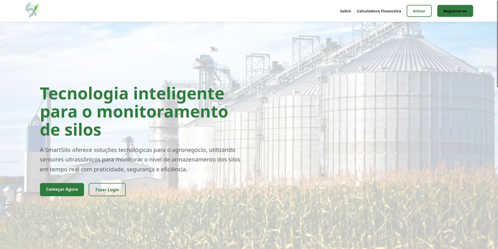

# SmartSilo

Projeto realizado por: Cauã Alonso Martos,

Jefferson William Watabe,

Oscar Gomes Ribeiro,

Pedro Henrique Passareli,

Pietro Dell'arno,

Raquel Yukari Taniwaki.

**OBJETIVO GERAL:**

Desenvolver uma solução tecnológica baseada em sensor ultrassônico capaz de
monitorar, em tempo real, o volume de grãos armazenados em silos
verticais, proporcionando maior controle, eficiência operacional e apoio
à tomada de decisão no pós-colheita.

**JUSTIFICATIVA:**

O projeto visa um acréscimo de lucro de aproximadamente 10% a 15% para o produtor.

**PROPOSTA DO PROJETO:**

O projeto consiste no desenvolvimento de uma solução tecnológica para
monitoramento do volume de grãos armazenados em silos verticais,
utilizando sensor ultrassônico instalado na parte superior da estrutura.

O sensor realiza medições contínuas da distância até o nível dos grãos e,
com base nesses dados, o sistema calcula automaticamente o percentual
de ocupação do silo.

As informações coletadas são enviadas para um sistema que armazena os
dados e os disponibiliza em uma interface visual (dashboard), permitindo
o acompanhamento em tempo real.

A proposta substitui métodos manuais e estimativas imprecisas por uma
solução automatizada, proporcionando maior controle operacional,
segurança e apoio à tomada de decisão no processo de armazenagem.
